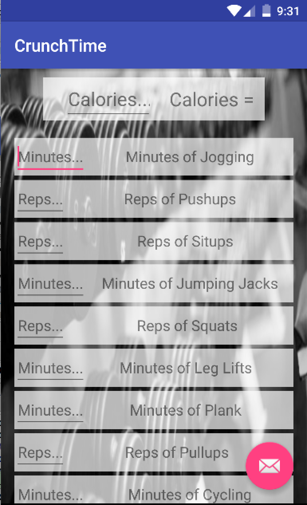
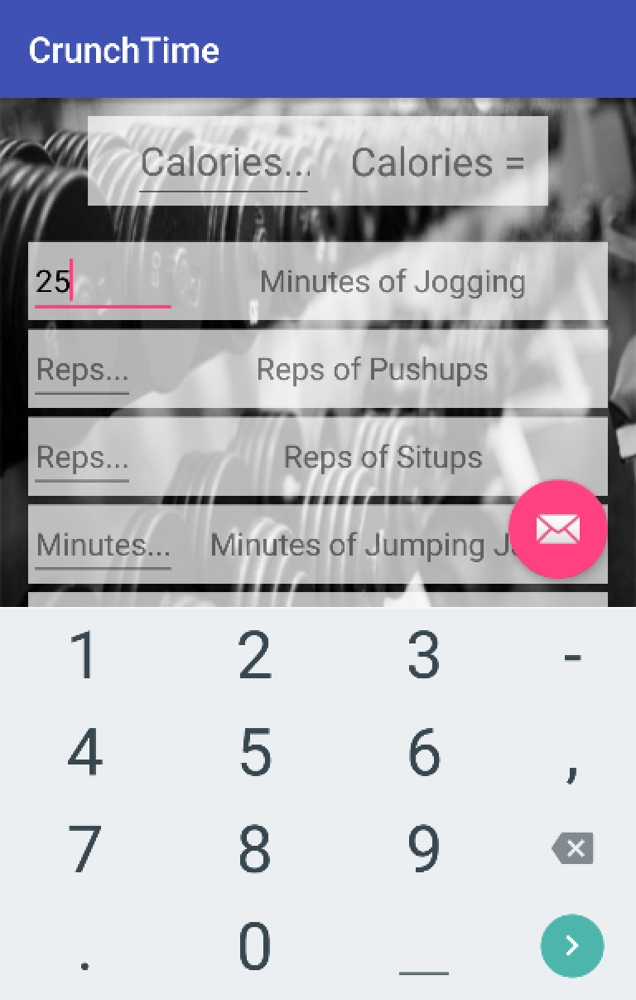
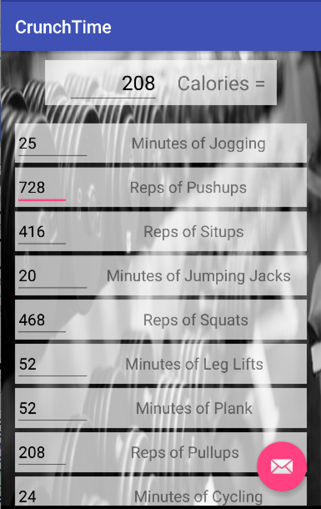

# PROG 01: Crunch Time

This app is designed for people interested in fitness and and staying healthy! In CrunchTime, you can see the minutes/repitions of one type of exercise in terms of other exercises. For example, how many pushups would burn the same amount of calories as 1 hour of jogging? Additionally, you can enter a target calorie number and see how much of each exercise you would have to complete to burn those calories.

## Authors

Stephanie Lin ([stlin@berkeley.edu](mailto:stlin@berkeley.edu))

## Demo Video

See [Prog 01: CrunchTime] (https://youtu.be/Pu5UMzp9OVg)

## Screenshots

## Acknowledgments

Background image is from Modeling Wisdom at this URL: http://modelingwisdom.com/wp-content/uploads/2014/10/gym-background-600x300.jpg

